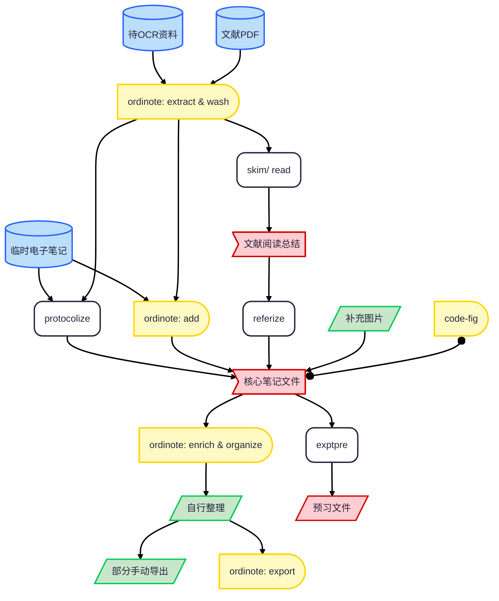

<h1 align="center">Resenote: Experiment Note Organizer</h1>

  
  

实验笔记与学术文献处理技能，把 OCR 识别的实验记录整理为标准 protocol，对学术文献产出速读与精读总结，检索相关文献补充笔记，并在实验操作前生成入门级预习资料。

## 功能

| # | 功能         | 说明                                                                                                                                                    | 定义文件                                 |
| - | ---------- | ----------------------------------------------------------------------------------------------------------------------------------------------------- | ------------------------------------ |
| 1 | protocol 格式化 | 将实验笔记转为标准 protocol，按「材料与试剂 / 实验关键原理及技术 / 实验步骤 / 其他操作 / 操作注意事项」五部分组织，步骤过少的实验合并为同一板块；另存为 `{原文件名}-protocol格式化.md`；不删改内容，仅调整顺序与逻辑 | `references/resenote-protocolize.md` |
| 2 | 学术文献速读     | 快速产出文献总结，含六个部分：文献基本信息、研究领域归属、文献类型、来源期刊与可信度评估、研究背景与研究目的、研究方法与研究结果；每篇标题为 12 字以内的精炼总结，多篇之间以 `---` 分隔                         | `references/resenote-skim.md`        |
| 3 | 学术文献精读     | 对单篇文献深入产出总结，含六个部分：文献基本信息、研究背景与研究目的、研究方法、数据分析与研究结果、全文展开及论证思路、批判性评价与局限性讨论；含研究类型判断、统计审查与论证链条梳理 | `references/resenote-read.md`        |
| 4 | 文献检索与笔记补充  | 针对指定笔记（未指定时询问笔记文件夹路径）在 PubMed、arXiv 等开放来源检索相关论文，用论文内容补充笔记；新增内容用淡蓝色 `<mark>` 包裹并标注文献来源，原有内容零改动，需详细信息时阅读原始文献 | `references/resenote-referize.md`    |
| 5 | 实验操作预习     | 针对目标实验检索入门级教程内容，过滤晦涩、专精的学术文章，优先采用教学类、教材类来源；生成含「实验介绍 / 实验器材与材料 / 实验操作步骤」三个核心板块的预习文件，另存为 `{实验名称}-预习.md`，内容精炼扼要 | `references/resenote-exptpre.md`     |

## 使用

### 安装

- 将技能目录（`SKILL.md` 与 `references/`）打包后上传到 Agent 客户端的技能上传/安装界面
- 直接将打包文件发送给模型，让其帮忙在客户端安装

### 在对话中激活

对模型说「把这份实验笔记转成 protocol」、「速读一下这几篇论文」、「精读这篇文献」、「帮我找文献补一下这份笔记」、「预习一下小鼠腹腔注射」等即可触发对应功能；技能入口与各功能的详细规范见 `SKILL.md` 与 `references/`

### 笔记工作流

- 圆柱：输入资料
- 平行四边形：人工处理
- 圆角矩形：LLM + skill 处理
- 长 D 形：其他 skill

